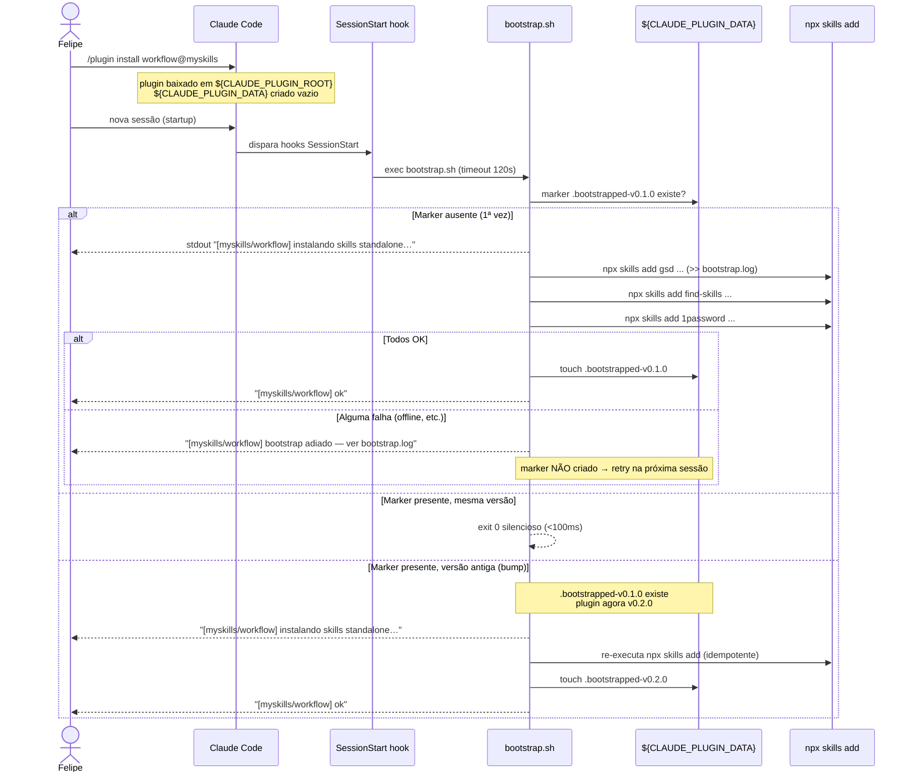

# Design: auto-install

## 1. Overview

Eliminar o passo manual `/<pkg>-setup` instalando standalones automaticamente na primeira sessão pós-`/plugin install`. Mecanismo: hook `SessionStart` (matcher `startup|resume`) que dispara `scripts/bootstrap.sh`, o qual executa `npx skills add ...` idempotentemente e grava um marker keyed por versão em `${CLAUDE_PLUGIN_DATA}`. Decisão registrada em `docs/adr/ADR-001-auto-install-strategy.md` (a criar). V1 implementa apenas `plugins/workflow`; `design`/`programming`/`marketing` ficam para specs futuras (ver §8). Base: [research.md](./research.md) (Alternativa B) e [requirements.md](./requirements.md) (US-1..US-7, FR-1..FR-13, NFR-1..NFR-9).

## 2. Architecture



## 3. File Structure

```
plugins/workflow/
├── .claude-plugin/
│   ├── plugin.json          # existing — sem mudanças
│   └── hooks.json           # NEW — registra SessionStart → bootstrap.sh
├── scripts/
│   └── bootstrap.sh         # NEW — installer idempotente, fail-soft
├── commands/
│   └── setup.md             # KEEP — vira fallback manual documentado
└── README.md                # MODIFY — instalação em 1 step + subseção fallback
```

Repo-level:

```
docs/adr/
└── ADR-001-auto-install-strategy.md  # NEW — política repo-wide
```

Totais: **3 NEW**, **2 MODIFY**, **1 KEEP-as-is** (plugin.json).

## 4. Component Design

### 4.1 `plugins/workflow/.claude-plugin/hooks.json` (NEW)

Satisfaz FR-1, NFR-2.

```json
{
  "hooks": {
    "SessionStart": [
      {
        "matcher": "startup|resume",
        "hooks": [
          {
            "type": "command",
            "command": "${CLAUDE_PLUGIN_ROOT}/scripts/bootstrap.sh",
            "timeout": 120
          }
        ]
      }
    ]
  }
}
```

Notas:
- `matcher: "startup|resume"` cobre nova sessão e resume após compactação.
- `${CLAUDE_PLUGIN_ROOT}` é resolvido pelo Claude Code em runtime; sobrevive reinstall do plugin (path muda, env var aponta sempre pro novo).
- `timeout: 120` = segundos (NFR-2). Falha de timeout = kill → marker não escrito → retry automático na sessão seguinte.

### 4.2 `plugins/workflow/scripts/bootstrap.sh` (NEW)

Satisfaz FR-2..FR-8, FR-13, NFR-1, NFR-3..NFR-8.

**Contrato:**
- Shebang: `#!/usr/bin/env bash`
- Flags: `set -uo pipefail` (sem `-e` — fail-soft por bloco, FR-2)
- Env consumed: `CLAUDE_PLUGIN_ROOT` (obrigatório), `CLAUDE_PLUGIN_DATA` (obrigatório)
- Plugin version: parse `${CLAUDE_PLUGIN_ROOT}/.claude-plugin/plugin.json` com `grep`/`sed` (sem `jq`, FR-3)
- Marker: `${CLAUDE_PLUGIN_DATA}/.bootstrapped-v<version>` (NFR-9)
- Log: `${CLAUDE_PLUGIN_DATA}/bootstrap.log`, append, timestamp ISO-8601 por execução (NFR-5)
- Output terminal PT-BR (NFR-8):
  - sucesso: `[myskills/workflow] instalando skills standalone…` + `[myskills/workflow] ok`
  - falha parcial: `[myskills/workflow] bootstrap adiado — ver ${CLAUDE_PLUGIN_DATA}/bootstrap.log`
  - no-op: 0 linhas
- Exit code: sempre 0 (NFR-3) — exceto bug interno.

```bash
#!/usr/bin/env bash
# bootstrap.sh — myskills/workflow auto-installer
# spec: specs/auto-install — design.md §4.2
# Fail-soft por bloco: NÃO usa `set -e` global de propósito.
set -uo pipefail

PLUGIN_NAME="workflow"
TAG="[myskills/${PLUGIN_NAME}]"

# Guards: env vars devem vir do Claude Code. Se ausentes, hook foi
# disparado fora de contexto — sai silencioso (FR-7, NFR-3).
: "${CLAUDE_PLUGIN_ROOT:?}" 2>/dev/null || exit 0
: "${CLAUDE_PLUGIN_DATA:?}" 2>/dev/null || exit 0

MANIFEST="${CLAUDE_PLUGIN_ROOT}/.claude-plugin/plugin.json"
[ -f "$MANIFEST" ] || exit 0

# Parse "version": "x.y.z" sem jq (FR-3). Funciona em bash 3.2 (macOS).
VERSION="$(sed -n 's/.*"version"[[:space:]]*:[[:space:]]*"\([^"]*\)".*/\1/p' "$MANIFEST" | head -n1)"
VERSION="${VERSION:-unknown}"

MARKER="${CLAUDE_PLUGIN_DATA}/.bootstrapped-v${VERSION}"
LOG="${CLAUDE_PLUGIN_DATA}/bootstrap.log"

# Fast path: marker já existe — no-op silencioso <100ms (FR-4, NFR-1).
[ -f "$MARKER" ] && exit 0

mkdir -p "${CLAUDE_PLUGIN_DATA}"

# Header de execução no log (NFR-5).
{
  echo "===== $(date -u +%Y-%m-%dT%H:%M:%SZ) bootstrap v${VERSION} ====="
} >> "$LOG" 2>&1

echo "${TAG} instalando skills standalone…"

# Cada bloco roda em subshell e captura falha individual sem matar o script.
# Fontes vêm de plugins/workflow/commands/setup.md (FR-8).
FAILED=0

run_step() {
  local label="$1"; shift
  {
    echo "--- ${label} ---"
    "$@"
  } >> "$LOG" 2>&1
  local rc=$?
  if [ $rc -ne 0 ]; then
    echo "[FAIL rc=${rc}] ${label}" >> "$LOG"
    FAILED=1
  fi
}

run_step "GSD bundle" \
  npx -y skills add git@github.com:glittercowboy/get-shit-done.git -y

run_step "find-skills (vercel-labs)" \
  npx -y skills add github:vercel-labs/skills --skill find-skills -y

run_step "1password (openclaw)" \
  npx -y skills add github:openclaw/openclaw --skill 1password -y

if [ "$FAILED" -eq 0 ]; then
  touch "$MARKER"
  echo "${TAG} ok"
else
  echo "${TAG} bootstrap adiado — ver ${LOG}"
fi

exit 0
```

Detalhes de implementação:
- `: "${VAR:?}" 2>/dev/null || exit 0` — se env var ausente, sai sem erro (não polui startup).
- `sed -n 's/.*"version".../`: tolerante a whitespace; pega o primeiro match (top-level wins na prática para nosso `plugin.json`).
- `run_step` encapsula cada install: redireciona stdout+stderr pro log, marca `FAILED=1` se rc≠0, mas continua para o próximo (fail-soft, FR-7).
- `mkdir -p "${CLAUDE_PLUGIN_DATA}"` defensivo — Claude Code já garante criação mas custa nada.
- Nenhum `read` / prompt → FR-13.
- Flag `-y` duplicada (`npx -y` + `skills add ... -y`) elimina prompt em ambos níveis.

### 4.3 `plugins/workflow/commands/setup.md` (KEEP, anotar)

Satisfaz FR-9, US-5. Adicionar 1 linha no topo deixando claro que virou fallback manual:

```diff
 ---
 name: workflow-setup
 description: Instala skills standalone do package workflow (3rd-party fora de marketplaces)
 ---

 # /workflow-setup

+> **Fallback manual / re-execução.** A instalação destas skills roda automaticamente
+> no primeiro `SessionStart` após `/plugin install workflow@myskills`
+> (ver `scripts/bootstrap.sh`). Use este comando para forçar re-instalação,
+> debugar bootstrap quebrado, ou rodar sem depender do marker.
+
 Execute via Bash. Confirme com `/find-skills gsd` ao final.
```

Os 3 blocos `npx skills add` permanecem idênticos (FR-9 — sem checar marker).

### 4.4 `plugins/workflow/README.md` (MODIFY)

Satisfaz FR-10, US-6.

**Antes** (linhas 37–43):
```
## How to install

\`\`\`bash
/plugin marketplace add FelipeOFF/my-claude-code-skills
/plugin install workflow@myskills
/workflow-setup   # installs GSD bundle, find-skills, 1password via npx
\`\`\`
```

**Depois:**
```
## How to install

\`\`\`bash
/plugin marketplace add FelipeOFF/my-claude-code-skills
/plugin install workflow@myskills
\`\`\`

Standalones (GSD, find-skills, 1password) são instaladas automaticamente
na primeira sessão pós-install via hook `SessionStart` + `scripts/bootstrap.sh`.
Marker em `${CLAUDE_PLUGIN_DATA}/.bootstrapped-v<version>` garante idempotência.

### Re-instalação / fallback

Se o bootstrap automático falhar (offline na 1ª sessão, fonte temporariamente
fora do ar, etc.), rode manualmente:

\`\`\`bash
/workflow-setup
\`\`\`

Para forçar re-bootstrap em sessão futura (ex: depois de limpar `~/.skills/`),
delete o marker:

\`\`\`bash
rm "${CLAUDE_PLUGIN_DATA}/.bootstrapped-v"*
\`\`\`

Decisão de arquitetura: ver `docs/adr/ADR-001-auto-install-strategy.md`.
```

Atualizar também a tabela "Standalone setup" (linha 29): trocar título
de "Standalone setup (run `/workflow-setup`)" → "Standalone setup (auto)".

### 4.5 `docs/adr/ADR-001-auto-install-strategy.md` (NEW)

Satisfaz FR-11, US-6, US-7. Estrutura:

```markdown
# ADR-001: Auto-install de skills standalone via SessionStart hook

- Status: Accepted
- Date: 2026-05-11
- Spec: specs/auto-install/{research,requirements,design}.md

## Context
Marketplace `myskills` distribui plugins que dependem de skills 3rd-party
externas (GSD, find-skills, 1password, ECC, Matt Pocock, FelipeOFF/*).
Hoje o usuário roda `/<pkg>-setup` manualmente após `/plugin install`.
Step esquecível → onboarding quebra.

## Alternatives considered
- A — `postInstall` em `plugin.json` — não existe no schema.
- B — `SessionStart` hook + marker em `${CLAUDE_PLUGIN_DATA}` — pattern canônico Anthropic.
- C — Auto-invoke via `/plugin install` — não existe mecanismo.
- D — Cross-marketplace `dependencies` — só funciona para plugins registrados; não cobre `npx skills add`.
- E — Bundle inline em `./skills/` — quebra upstream sync; viola Constituição (standalone).

(Detalhes em specs/auto-install/research.md tabela §"Alternatives A–E".)

## Decision
Adotar **B** como mecanismo primário para skills standalone.
Manter **D** para plugin deps já registrados (sem mudança).
Reservar **E** para casos específicos (FelipeOFF/* tiny skills onde vendoring é mais barato).

## Consequences
**Positivas:** instalação em 1 step; idempotente por versão; sobrevive update do plugin;
fail-soft em offline; preserva `/<pkg>-setup` como fallback.

**Negativas:** bootstrap roda na 1ª sessão (não no momento do install); requer rede na 1ª sessão;
hook precisa ser robusto a falha parcial.

**Exceção conhecida:** `uipro-cli` (npm global + interactive init) permanece manual via `/design-setup`.

## Replicação para outros plugins (3 passos, <5min)
1. Copiar `plugins/<src>/.claude-plugin/hooks.json` verbatim para o plugin destino.
2. Copiar `plugins/<src>/scripts/bootstrap.sh`; trocar `PLUGIN_NAME` e os blocos `run_step` pelas fontes do destino (lista vem do `commands/setup.md` atual).
3. Atualizar `plugins/<dst>/README.md` mudando install primário e marcando `/<pkg>-setup` como fallback.

V1 cobre `workflow`. Specs futuras: `design`, `programming`, `marketing`.

## References
- specs/auto-install/research.md
- specs/auto-install/requirements.md
- https://code.claude.com/docs/en/plugins-reference
- https://code.claude.com/docs/en/hooks
```

## 5. Technical Decisions

| Decisão | Escolha | Rationale | Alternativas rejeitadas |
|---|---|---|---|
| Hook event | `SessionStart` matcher `startup\|resume` | Único mecanismo Anthropic-documentado p/ "rodar após install" | `PostToolUse` (semântica errada); `onInstall` não existe |
| Marker location | `${CLAUDE_PLUGIN_DATA}/.bootstrapped-v<version>` | Sobrevive a update do plugin; keyed por versão = re-roda no bump | `${CLAUDE_PLUGIN_ROOT}` (wiped on update); hash de script (over-engineering) |
| Failure mode | Fail-soft, marker só em 100% sucesso | Permite retry automático na próxima sessão; nunca bloqueia startup (NFR-3) | Hard fail (trava CC); silent forget (sem retry) |
| Output | 2 linhas PT-BR + log completo em arquivo | Match com `rules/portuguese.md` + concisão (NFR-8) | Output cru de `npx` no terminal (ruidoso); silencioso total (sem feedback) |
| Version parsing | `sed` no `plugin.json`, sem `jq` | Bash 3.2 macOS compatível, zero dependency (FR-3) | `jq` (dep extra); hardcoded (drift); env var (Anthropic não fornece) |
| `set -e` | Omitido propositalmente; usa `set -uo pipefail` | Permite capturar falha por bloco e decidir não criar marker | `set -e` global (mata script no 1º falha → não dá retry parcial) |
| `uipro-cli` | Permanece em `/design-setup` manual | Toca npm global + init interativo (out of scope, ver ADR-001) | Auto-install (surpreende user, requer prompt) |
| Plugin `copy` | Não recebe `hooks.json` em V1 | Sem standalones até v0.2 (Out of Scope) | Ship hook no-op (cruft desnecessário) |

## 6. Error Handling

| Cenário | Comportamento | Visibilidade ao usuário |
|---|---|---|
| Offline | `npx` falha → log + `FAILED=1` → continua → marker não escrito | `[myskills/workflow] bootstrap adiado — ver …/bootstrap.log` |
| `npx` ausente do PATH | `run_step` retorna rc≠0 → mesma rota | idem |
| Uma fonte específica unreachable | bloco falha; outros blocos rodam; marker não escrito | idem |
| `jq` não instalado | irrelevante — script usa `sed` (FR-3) | silencioso |
| `CLAUDE_PLUGIN_DATA` ausente | `: "${VAR:?}" 2>/dev/null \|\| exit 0` → exit 0 silencioso | silencioso |
| `plugin.json` ausente | `[ -f "$MANIFEST" ] \|\| exit 0` | silencioso |
| Timeout >120s | Claude Code mata processo; marker não escrito | depende do CC (mensagem do harness) |
| Marker presente, versão igual | exit 0 em <100ms | silencioso (NFR-1) |
| Marker presente, versão diferente | `[ -f "$MARKER" ]` falha (path muda) → re-bootstrap | linhas normais de install |
| Bug do próprio script (`set -u` em var não inicializada) | exit ≠0 — Claude Code reporta hook error | mensagem do CC |

## 7. Test Strategy

Testes manuais (script de install, não código de aplicação). Cada item vira checkbox no PR body (FR-12).

1. **Fresh install path** (US-1, FR-12)
   - [ ] `claude plugin uninstall workflow@myskills` (se já instalado).
   - [ ] `rm -rf "$(claude plugin data-dir workflow 2>/dev/null || echo ~/.claude/plugins/data/workflow)"` (limpa marker).
   - [ ] `claude plugin install workflow@myskills`.
   - [ ] Abrir nova sessão CC.
   - [ ] Confirmar stdout exibe `[myskills/workflow] instalando skills standalone…` e em seguida `[myskills/workflow] ok`.
   - [ ] `ls ${CLAUDE_PLUGIN_DATA}/.bootstrapped-v0.1.0` existe.
   - [ ] `/help` lista `gsd-*`, `find-skills`, `1password`.

2. **Returning session** (US-2, NFR-1)
   - [ ] Fechar e reabrir CC.
   - [ ] Confirmar 0 linhas do bootstrap no terminal.
   - [ ] `time bash plugins/workflow/scripts/bootstrap.sh` (executando standalone com env vars setadas) <100ms.

3. **Version bump** (US-3)
   - [ ] Editar `plugin.json` → `"version": "0.2.0"` (local, teste).
   - [ ] Abrir nova sessão.
   - [ ] Confirmar bootstrap roda de novo, terminal mostra linhas PT-BR.
   - [ ] `ls ${CLAUDE_PLUGIN_DATA}` mostra ambos markers `.bootstrapped-v0.1.0` e `.bootstrapped-v0.2.0`.

4. **Offline path** (US-4, FR-7)
   - [ ] Limpar marker.
   - [ ] Desligar Wi-Fi (ou `sudo pfctl` block `registry.npmjs.org`).
   - [ ] Abrir nova sessão.
   - [ ] CC abre normalmente (não trava).
   - [ ] Terminal: `[myskills/workflow] bootstrap adiado — ver …/bootstrap.log`.
   - [ ] `cat ${CLAUDE_PLUGIN_DATA}/bootstrap.log` mostra falhas.
   - [ ] Marker ausente.
   - [ ] Religar rede → abrir nova sessão → bootstrap completa → marker escrito.

5. **Manual fallback** (US-5, FR-9)
   - [ ] Com plugin instalado + marker presente, rodar `/workflow-setup`.
   - [ ] Confirmar reinstala (saída do `npx` aparece no chat).
   - [ ] Marker permanece intacto.

## 8. Replicability Checklist

Para clonar o padrão p/ `plugins/{design,programming,marketing}` (specs futuras):

- [ ] Copy `plugins/workflow/.claude-plugin/hooks.json` → destino (zero edição — usa `${CLAUDE_PLUGIN_ROOT}` relativo).
- [ ] Copy `plugins/workflow/scripts/bootstrap.sh` → destino:
  - [ ] Trocar `PLUGIN_NAME="workflow"` pelo nome do plugin.
  - [ ] Substituir os 3 blocos `run_step ...` pelas fontes do `commands/setup.md` daquele plugin.
- [ ] Atualizar README do plugin destino: mover `/<pkg>-setup` para subseção "Re-instalação / fallback" e adicionar 1 linha sobre bootstrap automático.
- [ ] Anotar topo do `commands/setup.md` do plugin destino indicando que é fallback.

**Estimativa:** <5 min por plugin. Exceção: `design` precisa adicionalmente marcar `uipro-cli` como "permanece manual" (ver ADR-001).

## 9. Open Questions for Implementation

1. **Exato idiom de parse `plugin.json`**: o `sed` proposto (linha 28 do script) cobre o caso atual mas pode quebrar se `plugin.json` ganhar formatação non-standard (ex: multiline key). Decidir na implementação se vale um fallback `python3 -c 'import json...'` (presente em ambos macOS e Linux modernos) caso `sed` retorne empty.
2. **Local exato de `CLAUDE_PLUGIN_DATA`**: confirmar empiricamente o path resolvido pelo Claude Code atual (varia entre `~/.claude/plugins/data/<plugin>/` e variantes) ao documentar os testes manuais — não muda o design, mas afeta os comandos de cleanup no PR body.
3. **Quoting de `${CLAUDE_PLUGIN_DATA}` no `rm` do README**: validar que a expansão acontece no shell do usuário (que pode não ter a var setada fora do contexto CC). Pode precisar trocar por path literal documentado.
